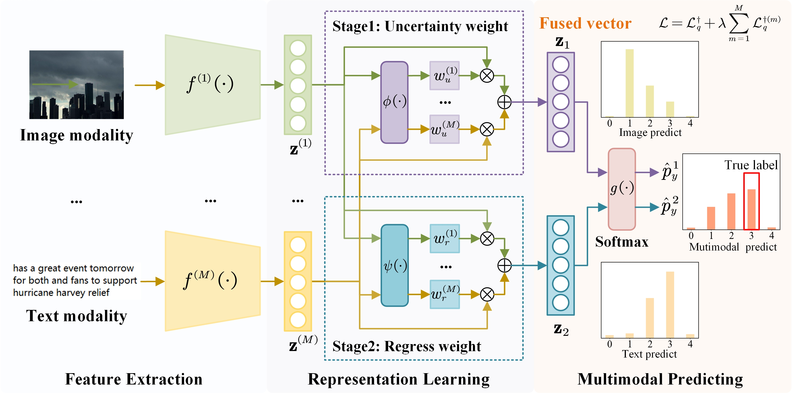

[](https://pubsonline.informs.org/journal/ijoc)

# Two-Stage Dynamic Fusion Framework for Multimodal Classification Tasks

This archive is distributed in association with the [INFORMS Journal on
Computing](https://pubsonline.informs.org/journal/ijoc) under the [MIT License](LICENSE).

The software and data in this repository are a snapshot of the software and data
that were used in the research reported on in the paper 
[Two-Stage Dynamic Fusion Framework for Multimodal Classification Tasks](https://doi.org/10.1287/ijoc.2023.0448.cd) by Shoumeng Ge and Ying Chen.
The snapshot is based on the author's repository,
[TMF](https://github.com/dlutor/TMF).

## Cite

To cite the contents of this repository, please cite both the paper and this repo, using their respective DOIs.

https://doi.org/10.1287/ijoc.2023.0448 

https://doi.org/10.1287/ijoc.2023.0448.cd

Below is the BibTex for citing this snapshot of the repository.

```
@misc{ge2025two,
  author =        {Shoumeng Ge and Ying Chen},
  publisher =     {INFORMS Journal on Computing},
  title =         {{Two-Stage Dynamic Fusion Framework for Multimodal Classification Tasks}},
  year =          {2025},
  doi =           {10.1287/ijoc.2023.0448.cd},
  url =           {https://github.com/INFORMSJoC/2023.0448},
  note =          {Available for download at https://github.com/INFORMSJoC/2023.0448},
}  
```

## Description

This repository provides a new image-text multimodal fusion framework designed for classification tasks. Four online datasets are provided to replicate the results in the paper. The results for MVSA and CrisisMMD datasets are located in the `emc_data` folder. For other datasets, please refer to the [stage2/README.md](./stage2/README.md) for instructions.





## Preparation
Install the required dependencies:
```bash
pip install -r requirements.txt
```

## Datasets
Please download the datasets manually from the following sources and place them into the specified directories:

MVSA: Download from [MVSA kaggle](https://www.kaggle.com/datasets/vincemarcs/mvsasingle). Place the `data` folder into `datasets/MVSA_Single`.

UPMC Food101: Download from [UPMC Food101 kaggle](https://www.kaggle.com/datasets/gianmarco96/upmcfood101). Place the `images` folder into `datasets/food101`.

CrisisMMD: Download from [CrisisMMD v2.0](https://crisisnlp.qcri.org/data/crisismmd/CrisisMMD_v2.0.tar.gz). Place the `data_image` folder into `datasets/CrisisMMD`.

N24News: Download from [N24News](https://github.com/billywzh717/N24News). Place the `imgs` folder into `datasets/N24News`.

## Stage 1: Train and Test
Run the following shell scripts to train and test the baseline models:

```bash
bash ./shells/train_MVSA.sh
bash ./shells/trainCrisisMMD_h.sh
bash ./shells/trainfood101.sh
bash ./shells/trainfood101_vit.sh
bash ./shells/trainN24News_a.sh
```

## Stage 2: Regression-based Fusion
Enter the stage 2 directory:

```bash
cd stage2
```

Run the following command:

### MVSA
```python
python stage2.py --output_dir ../saved --name MVSA_Single --dataset MVSA_Single \
--model KNet  \
--nlayers 1  \
--n_nodes 128  \
--top_k_logits 200  \
--epochs 100  \
--batch_size 128  \
--lr 1e-3 \
--gpu 0 \
--noise 0 \
--data_nums 0
```

### CrisisMMD
```python
python stage2.py --output_dir ../saved --name CrisisMMD --dataset CrisisMMD \
--model KNet  \
--nlayers 1  \
--n_nodes 128  \
--top_k_logits 200  \
--epochs 100  \
--batch_size 128  \
--lr 1e-3 \
--gpu 0 \
--noise 0 \
--data_nums 0
```

### Food101
```python
python stage2.py --output_dir ../saved --name food101 --dataset food101 \
--model KNet  \
--nlayers 1  \
--n_nodes 128  \
--top_k_logits 200  \
--epochs 100  \
--batch_size 128  \
--lr 1e-3 \
--gpu 0 \
--noise 0 \
--data_nums 0
```

### N24News
```python
python stage2.py --output_dir ../saved --name N24News --dataset N24News \
--model KNet  \
--nlayers 1  \
--n_nodes 128  \
--top_k_logits 200  \
--epochs 100  \
--batch_size 128  \
--lr 1e-3 \
--gpu 0 \
--noise 0 \
--data_nums
```


<!-- "# TMF Two-Stage Multimodal Fusion"  -->

